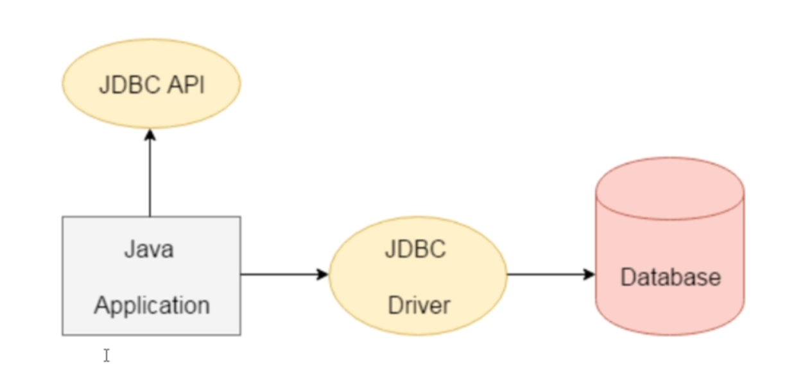

### JSP 

- Template Engine.
- Can be thought of as an extension to Servlet because it provides more functionality than servlet such as expresion language, JSTL etc.
- JSP page consists of HTML tags and JSP tags.
- JSP pages are easier to maintain than Servlet because we can seperate desigining and deployment.
- Additional features like Expression Language, Custom Tags etc.

### Advantages of JSP over servlet

- Extension to Servlet (All features of Servlet with additional features)
- Easy to maintain (Business Logic different than presentatio logic)
- Fast Development: No need to recompile and redeploy. (Servlets code needs to be updated and recompiled everytime)

### JDBC
- Java Database Connectivity
- Java API to connect and execute the query with the database.
- JDBC API uses JDBC drivers to connect with the database.
- 4 types JDBC drivers for different purpose and Database System.
- CRUD operation

## AdminLogin Servlet in Source Packages (src/java/servlets)

- javax Library is a must to write Servlet code.