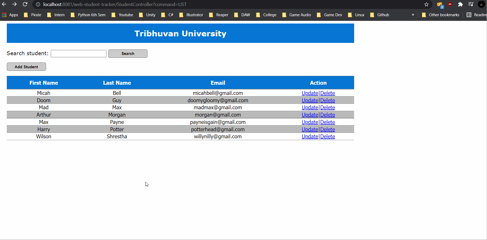

## CRUD Demo using JSP, Servlet, JDBC and MySQL
 

## Project Facets

- ### Dynamic Web Module: 5.0
- ### Java : 11
- ### Target Runtime: apache-tomee-webprofile-9.0.0-M7
- ### JSP JSTL Jar: jakarta.servlet.jsp.jstl-2.0.0.jar jakarta.servlet.jsp.jstl-api-2.0.0.jar 
- ### MySQL Connector: mysql-connector-java-8.0.26.jar
- ### web-app version in web.xml: 4.0
- ### MySQL Version: Ver 14.14 Distrib 5.7.35